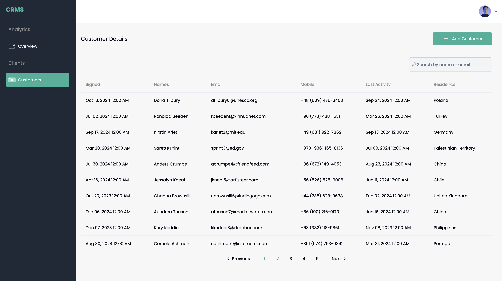

### CRMS Frontend Interview

## Project Overview

This project is a simple Next.js web application that fetches and visualizes website visit data and customer data from a CRM. It demonstrates the ability to work with data, APIs, and modern frontend development tools while ensuring performance and user experience.




## Features

- **Landing Page**: Displays aggregated data for total visitors, bounce rate, and average session duration.
- **Detailed Visit Analysis**: Provides a graph showing trends for website visits over the past 30 days using Chart.js.
- **CRM Data List**: Displays customer data with pagination and a search bar to filter the list of customers by name or email.

## Setup Instructions

### Prerequisites

- **Node.js**: Make sure you have Node.js installed on your local machine. You can download it from [nodejs.org](https://nodejs.org/).
- **npm or yarn**: Ensure you have one of these package managers installed. npm comes with Node.js, and you can install yarn by following the instructions on [yarnpkg.com](https://yarnpkg.com/).
- **mockaroo** : Make sure you have an account on Mockaroo you use your own api keys to fetch the fake data. you can create on from [here](https://mockaroo.com)

### Installation

1. Clone the repository:
   ```bash
   git clone git@github.com:kalisaNkevin/crms.git
   cd CRMS
   ```
2. Add .env.local file in the file directory:
   ```bash
   Refer your self from the .ENV.EXAMPLE to use your own keys.
   ```
3. Build the schema according to this reference here :


### Install dependencies

1. In your terminal execute the following command depending on your package manager :

```bash
npm install
# or
yarn install
```

### Running the Project

1. In your terminal execute the following command depending on your package manager :

```bash
npm run dev
# or
yarn dev
```

2. Your application will be available at <http://localhost:3000>.
